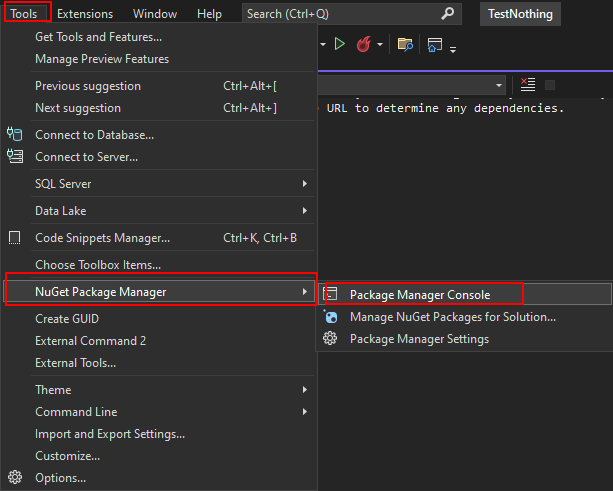

# School API

A School API Project

## Prerequisites

```
Microsoft Visual Studio Community 2022, Versión 17.4.3
SQL Server 2016
```

## Install 
1. Config the appsettings.json file. Edit "ConnectionStrings".
2. Compile the project.
3. Create the Database: Tools => NutGet Package Manager => Package Manager Console. Ex.
   
4. Execute Update-Database 
